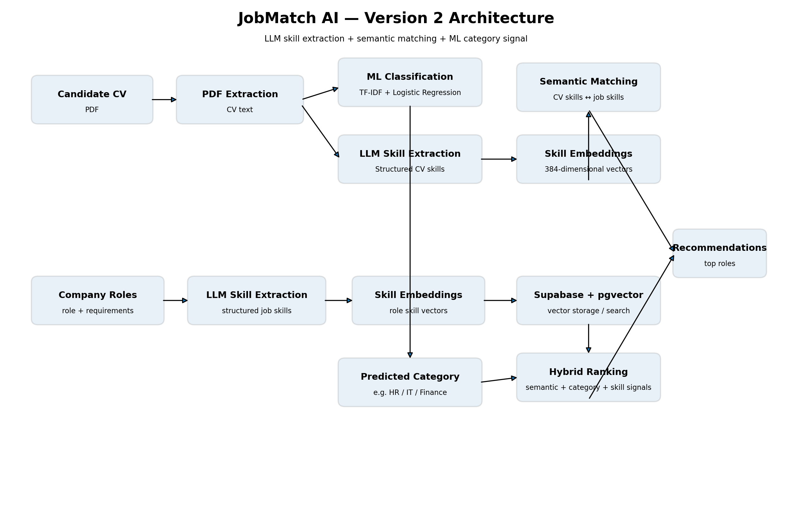

# JobMatch AI

**JobMatch AI** is an AI-powered job recommendation system that analyzes
a candidate's CV and matches it with available company job roles.

This project is developed as part of my learning and portfolio journey
as an **AI Engineer**, with a focus on **Machine Learning, NLP,
embeddings, semantic matching, LLM integration, and vector databases**.

> **Current status:** Version 2 is under development.

------------------------------------------------------------------------

## Project Goal

The main goal of JobMatch AI is to answer:

> **"Based on this CV, which available job roles are the most suitable
> for this candidate?"**

The system combines two AI approaches:

1.  **Machine Learning Classification** --- predicts a broad
    professional category from the CV.
2.  **Semantic Skill Matching** --- compares CV skills with skills
    required by company roles using embeddings.

------------------------------------------------------------------------

# Version 1 --- Initial Baseline

Version 1 was created as a baseline to understand the fundamental
workflow of CV classification and job recommendation.

### Version 1 Pipeline

``` text
CV (PDF)
   │
   ▼
PDF Text Extraction
   │
   ├───────────────┐
   ▼               ▼
TF-IDF          Embedding
   │               │
   ▼               ▼
Logistic        Vector
Regression      Similarity
   │               │
   └───────┬───────┘
           ▼
     Skill Matching
           │
           ▼
     Final Job Score
           │
           ▼
    Job Recommendations
```

### Version 1 Machine Learning

The CV classification component uses:

-   TF-IDF
-   Logistic Regression
-   24 categories from the Kaggle Resume Dataset
-   70/15/15 train-validation-test split
-   5,000 TF-IDF features

  Metric                  Result
  --------------------- --------
  Validation Accuracy     63.44%
  Test Accuracy           70.24%
  Best C                     2.0
  Test Samples               373

### Version 1 Limitations

#### 1. Keyword-oriented skill matching

The initial matching approach relied heavily on whether a skill appeared
directly in the CV text.

For example:

``` text
CV:              Payroll Administration
Job requirement: Payroll Processing
```

A lexical approach may treat these as different even though they are
semantically related.

#### 2. Simplified company roles

The first company-role dataset contained only a small number of
simplified roles, making it less representative of a real recruitment
scenario.

#### 3. Unstructured job requirements

Job requirements could contain long natural-language descriptions rather
than clean skill lists.

For example:

``` text
"Experience building AI-powered products, designing evaluation
systems, monitoring model quality, and working with data pipelines..."
```

This makes direct keyword matching difficult.

#### 4. Weak connection between classification and recommendation

The ML model predicts one of the 24 Kaggle categories, while the company
dataset contains its own set of job roles.

Therefore, a direct mapping such as:

``` text
Kaggle Category → Company Role
```

is only a heuristic and should not be treated as ground truth.

------------------------------------------------------------------------

# Version 2 --- Semantic & Skill-Aware Matching

Version 2 was created to address the limitations identified during
Version 1.

## Main Objectives

Version 2 aims to:

-   convert narrative job requirements into structured skills;
-   extract skills from CV text;
-   compare CV skills and job skills semantically;
-   use embeddings instead of relying only on exact keyword matching;
-   store role embeddings in Supabase + pgvector;
-   combine multiple signals into a hybrid ranking;
-   make recommendations more explainable;
-   create a pipeline that is closer to a real-world AI engineering
    system.

------------------------------------------------------------------------

# Version 2 Architecture



### Candidate CV Pipeline

``` text
Candidate CV
     │
     ▼
PDF Text Extraction
     │
     ├───────────────────────┐
     │                       │
     ▼                       ▼
TF-IDF + ML             LLM Skill Extraction
Classification                │
     │                        ▼
     ▼                   Structured CV Skills
Predicted Category            │
                              ▼
                       Skill Embeddings
                              │
                              ▼
                       Semantic Matching
                              │
                              ▼
                       Hybrid Ranking
                              │
                              ▼
                       Recommendations
```

### Company Role Pipeline

``` text
Company Role Dataset
        │
        ▼
Role Description
+ Required Skill
        │
        ▼
LLM Skill Extraction
        │
        ▼
Structured Job Skills
        │
        ▼
Skill Embeddings
        │
        ▼
Supabase + pgvector
```

The two pipelines meet during semantic matching:

``` text
CV Skills ───────────────┐
                         ├──► Semantic Matching ──► Hybrid Ranking
Job Skills / Embeddings ─┘
```

------------------------------------------------------------------------

# Version 2 Components

## 1. ML Classification

The existing TF-IDF + Logistic Regression model is retained as a **broad
category signal**.

It is not treated as the final job recommendation.

``` text
CV
 │
 ▼
TF-IDF
 │
 ▼
Logistic Regression
 │
 ▼
Predicted Category
      HR
```

## 2. LLM-Based Skill Extraction

Instead of manually creating a skill dictionary, an LLM is used to
extract relevant skills from narrative job requirements.

The extraction focuses on:

-   technical skills;
-   professional competencies;
-   tools;
-   methodologies;
-   domain-specific knowledge.

Generic words, years of experience, degrees, personality traits, and
complete sentences are excluded.

Example:

``` text
Narrative Job Requirement
          │
          ▼
          LLM
          │
          ▼
[
  "Machine Learning",
  "LLM",
  "RAG",
  "Data Pipelines",
  "Model Evaluation",
  "Prompt Engineering"
]
```

The same concept is applied to CV text to obtain structured candidate
skills.

## 3. Semantic Skill Matching

Each extracted skill is converted into an embedding using:

**Sentence Transformers --- `all-MiniLM-L6-v2`**

Embedding dimension:

``` text
384
```

The system compares CV skill embeddings against the skills associated
with each company role.

## 4. Supabase + pgvector

Company role embeddings are stored in:

``` text
Supabase
   │
   └── PostgreSQL
          │
          └── pgvector
```

This allows the system to perform vector similarity search over
available company roles.

## 5. Hybrid Ranking

Version 2 combines multiple signals instead of relying on a single
similarity score:

``` text
Semantic Skill Score
          +
Predicted Category Signal
          +
Skill Matching Signal
          │
          ▼
     Hybrid Ranking
          │
          ▼
 Recommended Roles
```

The weights are still experimental and will be evaluated further.

------------------------------------------------------------------------

# Version 2 Progress

## Completed

-   [x] Kaggle Resume Dataset analysis
-   [x] Resume preprocessing
-   [x] TF-IDF feature extraction
-   [x] Logistic Regression training
-   [x] Hyperparameter tuning
-   [x] ML model evaluation
-   [x] Company role dataset preparation
-   [x] Company role embeddings
-   [x] Supabase PostgreSQL setup
-   [x] pgvector integration
-   [x] Vector similarity search
-   [x] LLM-based company skill extraction
-   [x] Structured company skill dataset
-   [x] CV skill extraction using LLM
-   [x] CV skill embeddings
-   [x] Semantic skill matching
-   [x] Role-level semantic scoring
-   [x] ML category prediction integrated into recommendation
    experiments
-   [x] Initial hybrid scoring
-   [x] Version 2 notebooks added to the project

## In Progress

-   [ ] Robust evaluation across multiple CVs
-   [ ] Improve skill matching quality
-   [ ] Improve hybrid ranking strategy
-   [ ] Reduce dependency on repeated LLM calls during evaluation
-   [ ] Integrate Version 2 pipeline into Streamlit
-   [ ] Improve recommendation explanations

## Future Improvements

-   [ ] Experience-level matching
-   [ ] Skill normalization
-   [ ] Reranking
-   [ ] Retrieval evaluation
-   [ ] Recommendation evaluation metrics
-   [ ] Better candidate-job explanations
-   [ ] Production-ready API
-   [ ] Authentication and user management

------------------------------------------------------------------------

# Technology Stack

  Component             Technology
  --------------------- --------------------------------
  Interface             Streamlit
  Language              Python
  ML                    Scikit-learn
  Classifier            Logistic Regression
  Text Representation   TF-IDF
  Embeddings            Sentence Transformers
  Embedding Model       `all-MiniLM-L6-v2`
  Embedding Dimension   384
  Vector Database       Supabase PostgreSQL + pgvector
  LLM                   OpenRouter
  PDF Processing        pypdf

------------------------------------------------------------------------

# Project Structure

``` text
jobmatch-ai/
│
├── app.py
├── src/
│
├── data/
│   ├── raw/
│   ├── processed/
│   └── company_roles/
│       ├── company_roles.xlsx
│       └── company_roles_with_skills.xlsx
│
├── models/
├── notebooks/
│   ├── 01_eda_resume.ipynb
│   ├── 02_company_roles.ipynb
│   └── 03_cv_skill_extraction.ipynb
│
├── supabase/
├── .env.example
├── .gitignore
├── requirements.txt
└── README.md
```

------------------------------------------------------------------------

# Dataset

The resume dataset used for the machine learning component is from
Kaggle:

https://www.kaggle.com/datasets/snehaanbhawal/resume-dataset

The company role dataset is dummy data generated with AI for development
and experimentation. The required skills are based on general skills and
competencies associated with each role.

------------------------------------------------------------------------

# Learning Journey

This project is developed iteratively rather than as a single finished
system.

``` text
Data Processing
      │
      ▼
Machine Learning
      │
      ▼
NLP
      │
      ▼
Embeddings
      │
      ▼
Semantic Search
      │
      ▼
Vector Database
      │
      ▼
LLM Integration
      │
      ▼
Hybrid AI System
      │
      ▼
Evaluation
      │
      ▼
Deployment
```

Version 1 established the baseline system.

Version 2 focuses on making the matching process more semantic,
structured, explainable, and closer to a practical AI engineering
workflow.

> This project is still under active development.
